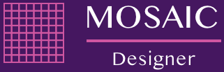
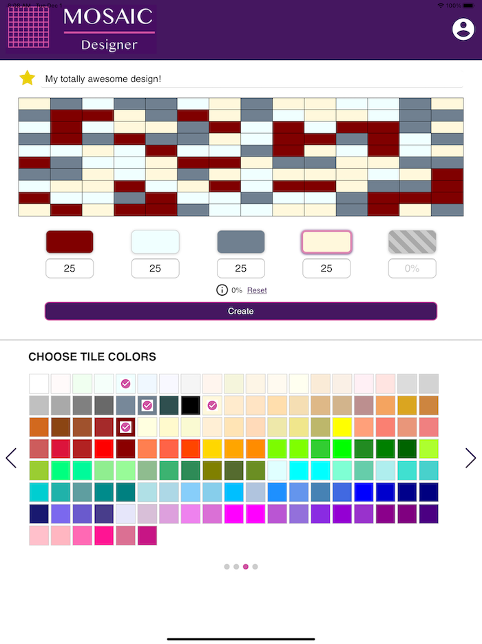

# Mosaic Designer (Legacy Mobile Application)

## ℹ️ Overview

**Mosaic Designer** is a legacy mobile design application created to help users design and visualize **custom mosaic tile patterns** for residential and commercial spaces such as kitchens and bathrooms.

The app was intended for use by:

- Homeowners and customers
- Architects and designers
- Showroom consultants
- Outside sales representatives

Users could experiment with mosaic layouts, tile sizes, color distributions, and grout colors, then save designs to user profiles for later access across devices.

## 💡 Example Use Case

A user might design a backsplash using:

- A 1×1 straight mosaic pattern
- An even color distribution (e.g. 25% each of blue, green, red, and yellow)
- A contrasting grout color

The application provided immediate visual feedback, allowing rapid iteration during the design process.

## 📄 Screenshots

## 📁 Design Artifacts

This project includes early-stage UX and design documentation:

- **Wireframe:** [docs/wireframe.pdf](docs/wireframe.pdf)
- **Mockup:** [docs/mockup.pdf](docs/mockup.pdf)
- **User Flow:** [docs/user-flow.pdf](docs/user-flow.pdf)

These artifacts illustrate the original design intent, layout decisions, and user interaction flow.

## 📦 Architecture & Technology Stack

This application reflects **mobile-web architecture common at the time of development**, prior to modern cross-platform frameworks.

### Core Technologies

- **Apache Cordova** – Hybrid mobile application framework
- **Vue.js** – Frontend JavaScript framework
- **Webpack** – Asset bundling and build pipeline
- **npm** – Dependency management

### Libraries & Tooling

- **Swiper** – Touch-based slider interactions
- **ESLint** – JavaScript linting
- **Mocha & Chai** – Unit testing

### Design Tools

- **Lucidchart** – Wireframes and user flows
- **Sketch** – Visual mockups

## 🚩 Notable Characteristics

- Offline-capable hybrid mobile app
- Touch-optimized UI for tablets and phones
- User authentication and profile-based saved designs
- Visual configuration rather than form-driven input
- Built before modern PWA and native cross-platform tooling became mainstream

## ℹ️ Legacy Context

This project predates:

- Progressive Web Apps (PWAs)
- Modern mobile frameworks such as React Native and Flutter
- Component-driven design systems

It is preserved as a **historical reference** and a demonstration of:

- End-to-end product development
- UX-driven application design
- Managing complexity with the tooling available at the time

## 📄 License

MIT
